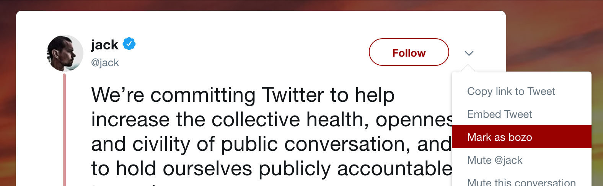
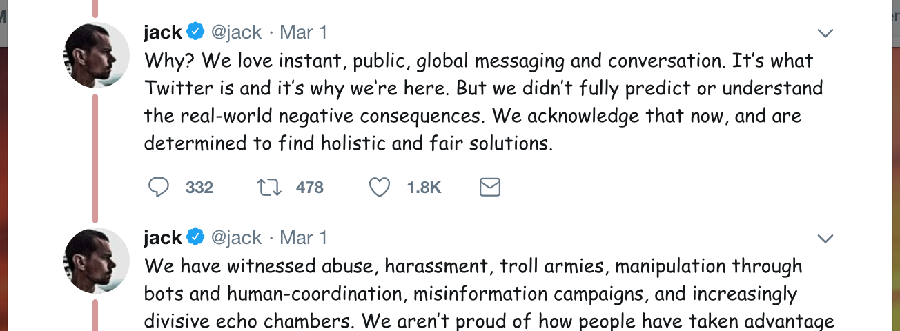
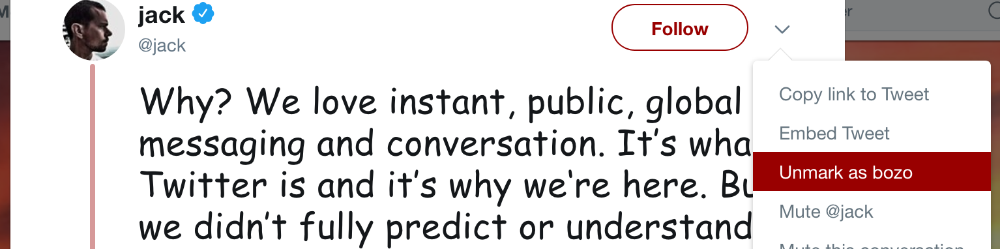

# bozobit

> One thing Twitter needs: a way to remind you that you have judged a person's
> opinions to be garbage and not worth spending time to examine them other
> than blocking/muting. Just have their tweet show up in grey or something.

-- Subbak, [July 7, 2018](https://twitter.com/Subb4k/status/1015674492260114432)

`bozobit` is a Firefox add-on to set the
[bozo bit](http://breckyunits.com/dont-flip-the-bozo-bit.html) on Twitter accounts.

# Install

[Get `bozobit`](https://addons.mozilla.org/firefox/addon/bozobit/) on the Firefox add-ons website.

# Usage

On any tweet, open the action menu and choose "Mark as bozo".

Tweets from the user now appear in a lovely font that stands out from other tweets.

To unmark the user, select "Unmark as bozo" from the action menu.

# Developing

Want to contribute to `bozobit` development? See [dev instructions](doc/DEVELOPING.md).
